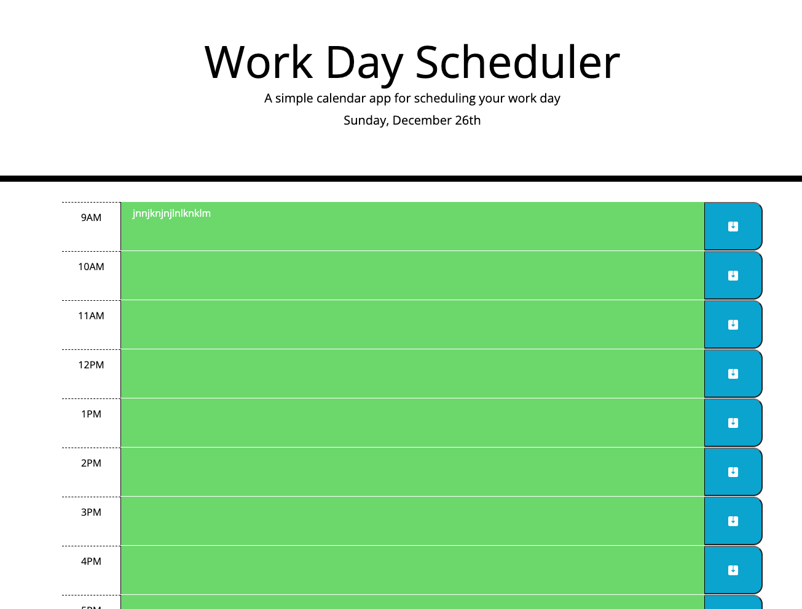

# Calendar

## This is a calendar app, it has a normal 8 hour workday. The present hour is colored red, past hours are colored grey, and future hours are colored red. When you type your hourly plans into the text boxes you can save them to local storage which will save the plans into the textbox you wrote them in. When the day hits midnight it will clear localStorage and your tasks from the previous day will be deleted.

### Deployed website: https://derpvoltz.github.io/calendar/